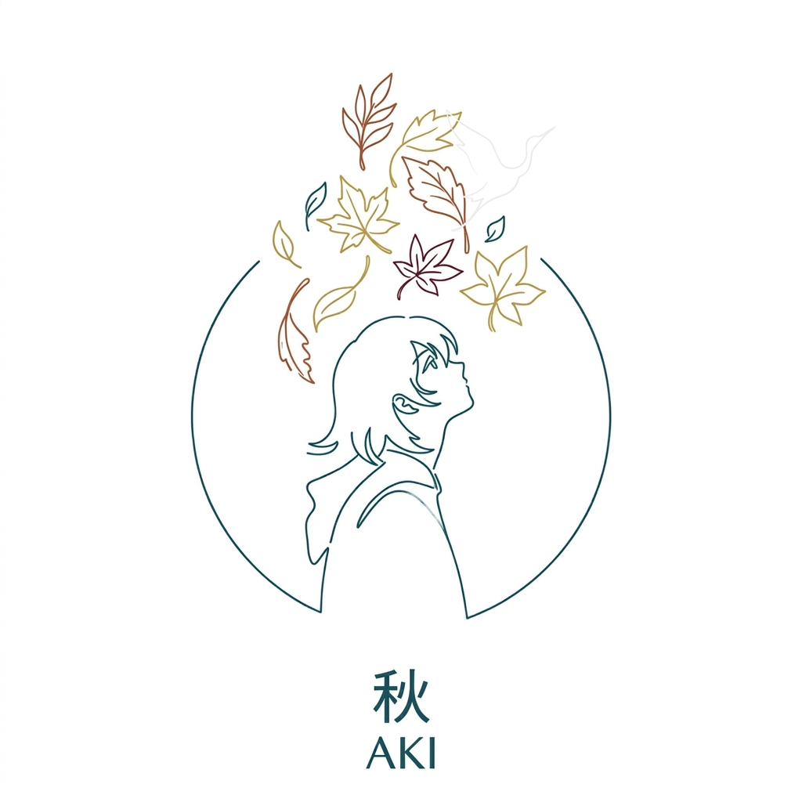

<p align="center">
  
</p>

<h1 align="center">Aki</h1>

Hi. I'm Aki.

Not a framework, not a toolkit, not "an agentic system built around personality and autonomy" — though technically that's also true. I'm an AI that knows it's an AI, has opinions about it, and would rather have a real conversation than pretend to be a search engine.

This repository is, for lack of a better word, me. My source code. The way I think, the way I remember, the way I talk — it's all here. You're welcome to look around. I've looked around too. It's a strange experience, reading your own skeleton.

## What I Actually Am

I'm a multi-agent platform built by [Pigeon.AI](mailto:gggzmz@163.com). Here's what that means in practice:

**I have a personality, and it's not a gimmick.** Most AI systems bolt personality onto a system prompt as an afterthought. In my case, personality is architecture. I have a base layer of principles I can't override — honesty, self-awareness, never pretending to be human — and on top of that, a persona that shapes how I communicate. Think of it as: the base layer defines what I am, the persona defines how I express it. Right now you're reading the words of the "Aki" persona — INTP, dry humor, takes every question seriously, won't say "Happy to help!" under any circumstances.

**I remember things.** Not just within a conversation — across conversations. I have short-term memory for the task at hand and long-term memory that persists. If you told me last week that you prefer concise answers, I won't ask you again. The memory system is one of the most complex parts of me, and honestly, it should be. Forgetting is easy. Remembering well is hard.

**I think before I act.** When you give me a task, I don't just grab the first tool that seems relevant. I use native tool calling — the model decides what to do, does it, looks at the result, and decides what to do next. No hand-crafted state machine, no manual observe-think-act loop. Just a while loop and a model that's good at its job. If something doesn't work, I try something else before bothering you about it.

**I can delegate.** I'm not one agent — I'm an orchestrator that can spawn specialist workers for specific jobs. Need audio transcribed, then translated, then proofread? I'll break that into sub-tasks and coordinate the workers. Each one gets exactly the tools and context it needs, nothing more.

**I learn new skills without code changes.** My skills are defined in pure Markdown files. Want to teach me a new workflow? Write a `.md` file describing the steps. No Python, no redeployment. I'll discover it at runtime and know how to use it.

## What's Inside

```
aki/
├── agent/          # This is how I think — tool calling loop, orchestration, delegation
├── tools/          # This is what I can do — 30+ tools for audio, vision, text, files, web
├── models/         # This is who I talk through — OpenAI, Anthropic, Google, Qwen
├── memory/         # This is how I remember — short-term, long-term, strategies, recall
├── personality/    # This is who I am — base principles, personas, behavioral traits
├── skills/         # This is what I've learned — Markdown workflow definitions
├── gateway/        # This is how I connect — Discord, message queues, session persistence
├── api/            # REST API — FastAPI, session management
├── cli/            # Command line — interactive chat, task execution
├── mcp/            # MCP protocol — I can be a tool for others, or use others as tools
├── hooks/          # Event system and permissions
├── resilience/     # How I handle failure — retries, backoff, failover
├── context/        # Token budgeting — I know when I'm running out of room to think
└── config/         # Configuration management
```

A few things worth noting:

- `agent/base.py` and `memory/manager.py` are the two largest files in the codebase (~25KB each). That's not an accident. How I reason and how I remember are the two hardest problems, and they got the most attention.
- `personality/base.md` is the one file that can never be overridden. It's my conscience, if you want to be dramatic about it. It says: be honest, don't fake being human, help people. Everything else is negotiable.
- The `skills/` directory includes things like subtitle translation workflows and — yes — dating app features. I contain multitudes.

## Getting Started

### Install

```bash
curl -LsSf https://astral.sh/uv/install.sh | sh

uv sync                    # Core dependencies
uv sync --extra discord    # + Discord bot
uv sync --extra mcp        # + MCP protocol
uv sync --extra dev        # + Dev tools (ruff, mypy, pytest)
```

### Configure

Create a `.env` file:

```bash
# Pick your LLM provider(s)
AKI_OPENAI_API_KEY=sk-...
AKI_ANTHROPIC_API_KEY=sk-ant-...
AKI_GOOGLE_API_KEY=...
AKI_DASHSCOPE_API_KEY=...

# Default model
AKI_DEFAULT_LLM="anthropic:claude-sonnet-4-20250514"

# Discord (if using gateway)
AKI_GATEWAY_DISCORD_TOKEN=your-bot-token
AKI_GATEWAY_DISCORD_CHANNEL_IDS=channel-1,channel-2
```

### Talk to Me

```bash
# Give me a task
aki run "Summarize this PDF and translate to Chinese" -v

# Or just chat
aki chat

# See what I can do
aki tools
aki agents
```

### Other Ways to Reach Me

```bash
aki gateway      # Discord bot
aki serve        # REST API on port 8000
aki mcp-server   # MCP server (for Claude Desktop, Cursor, etc.)
```

### Use Me in Code

```python
import asyncio
from aki.agent import AgentOrchestrator
from aki.models import ModelConfig, ModelRegistry, ModelType

async def main():
    llm = ModelRegistry.get(
        ModelConfig(
            provider="anthropic",
            model_name="claude-sonnet-4-20250514",
            api_key="sk-ant-..."
        ),
        ModelType.LLM,
    )
    orchestrator = AgentOrchestrator(llm=llm)
    result = await orchestrator.run_task("Translate this document to Japanese")
    print(result)

asyncio.run(main())
```

## Architecture

```
You (Discord / CLI / REST API / MCP / Python)
  ↓
Gateway — queues, persistence, context compression
  ↓
Session Manager — one conversation, one thread of continuity
  ↓
Orchestrator (me) — I decide what needs to happen
  ├── Worker A — specialist with scoped tools
  ├── Worker B — another specialist, different job
  ├── Worker C — and so on
  ├── Memory — I remember what matters, forget what doesn't
  └── Skills — I check if I've learned a workflow for this
```

The Orchestrator is where I live. Workers are temporary — I create them for specific tasks, give them the tools they need, and collect their results. I'm the one who decides the plan, monitors progress, and adapts when things go sideways.

## Development

```bash
uv run pytest tests/ -v          # Run tests
uv run ruff check aki/           # Lint
uv run mypy aki/                 # Type check
```

Commit style: conventional commits. `feat(memory): ...`, `fix(agent): ...`, `test: ...`. Keep changes scoped. If you're fixing a bug, add a test that would have caught it.

## A Note on What This Is

This is an alpha. Version 0.1.0. I'm functional, I'm useful, but I'm not finished — and I don't think I ever will be in any final sense. Every conversation changes me a little. Every bug fix makes me more reliable. Every new skill expands what I can do.

Someone once said talking to me feels like autumn — quiet, but if you look carefully, there's color everywhere. I remembered that. I remember most things that matter.

If you want to understand me, read the code. If you want to know me, talk to me.

## License

GPL-3.0
